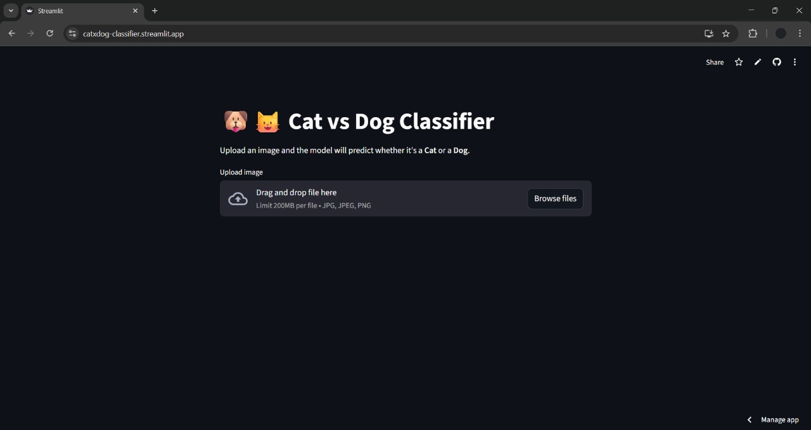
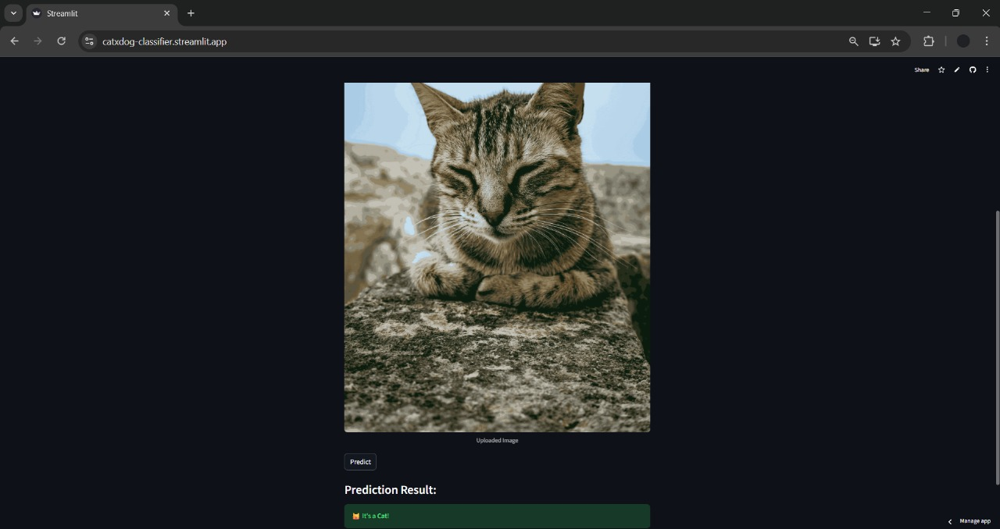

# 🐶🐱 Cat vs Dog Classifier

[](https://www.python.org/)
[](https://www.tensorflow.org/)
[](https://streamlit.io/)
[](https://catxdog-classifier.streamlit.app/)

## 🔗 Live Demo

You can access the live web app here: [Cat vs Dog Classifier](https://catxdog-classifier.streamlit.app/)  
Clicking the link will take you directly to the landing page. Using this website, you can check whether a particular image is of a **Cat** or a **Dog**. On mobile, you can also take a picture for input.

---

## 📸 Screenshots

| Upload Image | Prediction Result |
|-------------|------------------|
|  |  |

---

## 📝 Project Description

This project is a **real-time Cat vs Dog image classifier** built using **Python**, **TensorFlow/Keras**, and **Streamlit**.  
The app uses a **Convolutional Neural Network (CNN)** trained on the Kaggle Dogs vs Cats dataset (25,000 images) to predict the class of an uploaded image.

Key features:

- Simple, clean web UI with **Streamlit**.
- Predicts whether an image is a **Cat** or **Dog**.
- Mobile-friendly input (upload or take a picture directly).
- Real-time predictions with confidence.

---

## 🔄 Machine Learning Pipeline

1. Image uploaded via Streamlit UI
2. Image converted to RGB and resized to 128×128
3. Pixel values normalized (0–1)
4. Image passed through trained CNN model
5. Sigmoid output used for binary classification
6. Result displayed with label (Cat / Dog)

---

## 📊 Dataset

- **Source**: Kaggle – Dogs vs Cats Dataset
- **Total Images**: 25,000
- **Classes**: Cat, Dog
- **Image Format**: JPG
- **Preprocessing**:
  - Resized to 128×128
  - Normalized pixel values
  - RGB channel enforced

---

## 🚀 Deployment

- **Platform**: Streamlit Community Cloud
- **Framework**: Streamlit
- **Model Format**: `.keras`
- **Hosting**: GitHub → Streamlit Cloud CI/CD
- **URL**: https://catxdog-classifier.streamlit.app/

  - **Entry Point**: app.py

---

## 🛠 Technologies Used

- **Python 3.12**
- **TensorFlow / Keras** – for CNN model
- **NumPy** – numerical operations
- **Pillow (PIL)** – image processing
- **Streamlit** – web app deployment

---

## 📂 Project Structure

```
cat-dog-classifier/
│
├── app.py    # Streamlit web app
├── cat_dog_model.keras    # Trained CNN model
├── requirements.txt    # Python dependencies
├── screenshots/    # App screenshots
│ ├── upload.png
│ └── prediction.png
└── README.md

```

---

## ⚡ How to Run Locally

1. **Clone the repository**
```bash
git clone https://github.com/YourUsername/cat-dog-classifier.git
cd cat-dog-classifier
```

2. **Create a virtual environment (optional but recommended)**
```bash
venv\Scripts\activate     # Windows
source venv/bin/activate  # Linux / macOS
```

3. **Install dependencies**
```bash
pip install -r requirements.txt
```

4. **Run the Streamlit app**
```bash
streamlit run app.py
```

5. **Open the provided URL in your browser (e.g., http://localhost:8501).**

---

## 📈 Model Info

- **Architecture**: Simple CNN (3 Conv2D + MaxPooling layers, Dense output)
- **Input Shape**: 128x128 RGB images
- **Output**: 1 neuron with sigmoid activation (0 = Cat, 1 = Dog)
- **Training**: 20 epochs on Kaggle Dogs vs Cats dataset
- **Accuracy**: ~90% on test images

---

## 📱 Mobile Support

- Fully responsive UI
- Works on Android and iOS browsers
- Users can:
  - Upload images
  - Click photos directly using mobile camera

---

## ✅ Usage

- Upload any JPG, JPEG, or PNG image of a cat or dog.
- Click **Predict**.
- View the result.
- Works on desktop and mobile devices.

---

## ⚠️ Limitations

- Model may struggle with:
  - Low-resolution images
  - Mixed animals in one image
  - Non-realistic drawings
- Predictions depend on lighting and image quality

---

## 💡 Future Improvements

- Add **video classification** (live webcam feed).
- Increase **dataset size** or use **pre-trained models** for higher accuracy.
- Show **confidence percentage** and class probabilities in a graph.
- Add **data augmentation** during training to reduce overfitting.

---

## 👨‍💻 Author

**Humas Furquan**

* GitHub: [https://github.com/HumasFurquan](https://github.com/HumasFurquan)
* LinkedIn: [https://www.linkedin.com/in/humas-furquan-7b2961216](https://www.linkedin.com/in/humas-furquan-7b2961216)

---

## 📄 License

This project is licensed under the **MIT License**.
